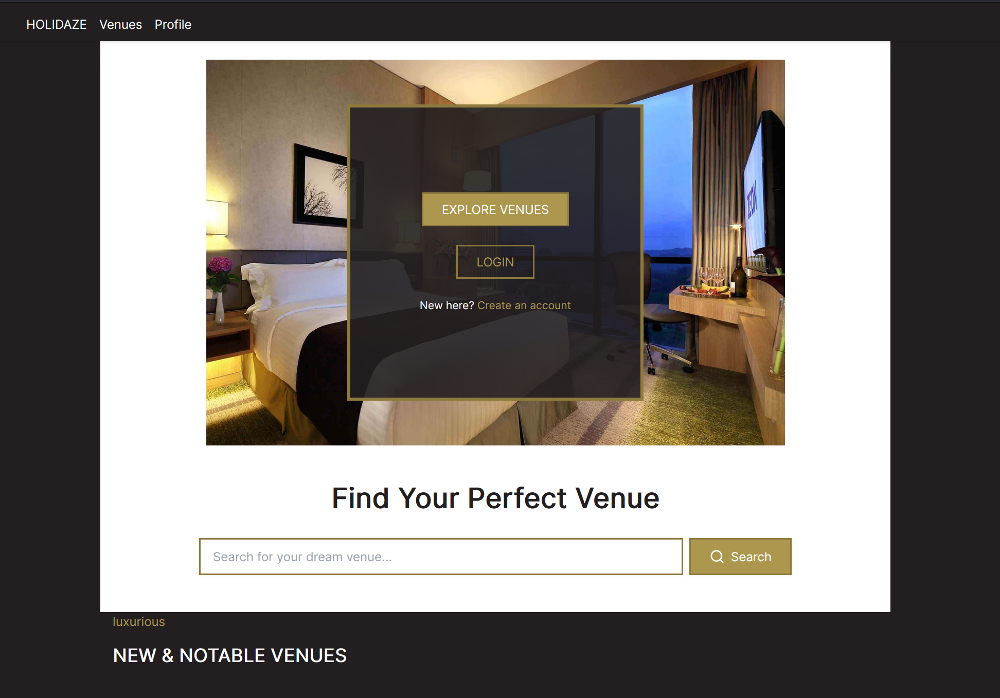

# Holidaze



Holidaze is a modern accommodation booking platform that connects property managers with travelers. Built with React, TypeScript, and Tailwind CSS, this application provides a seamless experience for booking and managing venues.

## Deployed Site
You can view the deployed site at: [Holidaze-rentals](https://holidaze-rentals.netlify.app/)

## Table of Contents
- [Features](#-features)
- [Tech Stack](#-tech-stack)
- [Getting Started](#-getting-started)
- [API Documentation](#-api-documentation)
- [Design](#-design)
- [Available Scripts](#available-scripts)
- [Deployment](#-deployment)
- [Contributing](#contributing)
- [Contact](#-contact)
- [License](#-license)
- [Acknowledgments](#-acknowledgments)

## 🌟 Features

### For Travelers
- Browse and search available venues
- View detailed venue information with photo galleries
- Check venue availability through an interactive calendar
- Create and manage bookings
- View booking history
- User profile management

### For Venue Managers
- Create and list new venues
- Manage venue details and availability
- View and handle booking requests
- Track venue performance
- Manage multiple properties

## 💻 Tech Stack
- React + TypeScript
- Redux Toolkit
- Tailwind CSS
- React Hook Form + Zod
- React Router
- Vite
- Lucide React

## 🚀 Getting Started

### Prerequisites
- Node.js (version 14 or higher)
- npm or yarn
- Git

### Installation
1. Clone the repository
```bash
git clone https://github.com/BergitTveit/PE2-Holidaze.git
```

2. Install dependencies
```bash
npm install
```

3. Create .env file based on .env.example
```
VITE_API_URL=https://api.noroff.dev/api/v2/holidaze
```

4. Start the development server
```bash
npm run dev
```

## Available Scripts
- `npm run dev` - Start development server
- `npm run build` - Build for production
- `npm run preview` - Preview production build
- `npm run lint` - Run ESLint
- `npm test` - Run tests

## 📝 API Documentation
This project uses the Noroff API. Documentation can be found at:
- [API Documentation](https://api.noroff.dev/api/v2/holidaze)
- [Swagger Documentation](https://api.noroff.dev/docs)

## 🎨 Design
The application features a modern, luxurious design with:
- Clean and minimalistic user interface
- Modern iconography using Lucide React
- Responsive layout for all devices
- Accessible design patterns
- Consistent brand styling and visual hierarchy

## 🚀 Deployment
The project is deployed on Netlify. View the live site at [Holidaze-rentals](https://holidaze-rentals.netlify.app/).

## Contributing
1. Fork the repository
2. Create your feature branch (`git checkout -b feature/AmazingFeature`)
3. Commit your changes (`git commit -m 'Add some AmazingFeature'`)
4. Push to the branch (`git push origin feature/AmazingFeature`)
5. Open a Pull Request

## 👥 Contact
Email: [bergittveit@yahoo.com](mailto:bergittveit@yahoo.com)

Project Link: [https://github.com/BergitTveit/PE2-Holidaze](https://github.com/BergitTveit/PE2-Holidaze)

## 📜 License
This project is licensed under the MIT License - see the LICENSE.md file for details

## 🙏 Acknowledgments
- Noroff School of Technology
- React Documentation
- Tailwind CSS
- Lucide Icons
